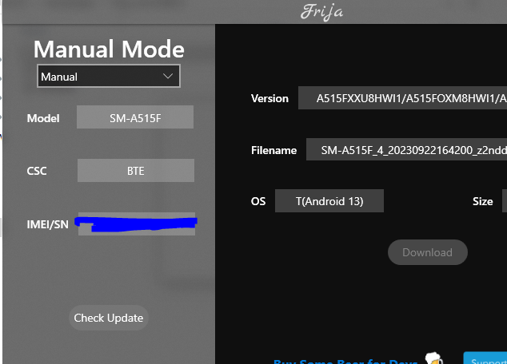

My old android phone is no longer serving me, and I replaced it's broken screen so many times I could have saved for a new one by now, so I decided to turn this zombie into my own guinea pig. It's model is [Samsung Galaxy A51](https://www.gsmarena.com/samsung_galaxy_a51-9963.php), and I found this [guide](https://xdaforums.com/t/galaxy-a51-root-unlock-bootloader-flash-official-firmware-binary-3-may.4053065/) which I will be following today.

**Disclaimer #1:** This is my first time ever unlocking an android phone, so expect some inaccuracies and educational guesses along the way.

**Disclaimer #2:** I bricked my device multiple times throughout this process but it's ok becuase my phone is no longer in use, in this post I only show the successful and final result, however you may need to exercise caution so you don't lose your phone.

## What we need

The tutorial seems to be written for Windows so no Linux today but that's alright. We also need to install:

- [Odin v3.14.1](https://dl2018.sammobile.com/Odin3-v3.14.1.zip)
- [Samsung Latest USB Driver](https://developer.samsung.com/galaxy/others/android-usb-driver-for-windows)
- Samsung firmware, the instructions says to install either [Samfirm 0.4.1](https://samfirmtool.com/samfirm-v0-4-1) or [Frija 1.4.2](https://github.com/wssyncmldm/frija/releases), I will go with SamFirm.
- Microsoft Visual C++ 2010 Redistributable Package) and (Microsoft Visual C++ 2008 Redistributable Package.

## Installing the Firmware

I used Frija to install the firmware like below:

It takes a while for the firmware to download. 

  
Find the list of Samsung CSC [here](https://technastic.com/samsung-csc-codes-list/)

## Preparing the other stuff

First, I need to install the [Samsung Latest USB Driver](https://developer.samsung.com/galaxy/others/android-usb-driver-for-windows), which is only necessary for windows. Then I install Odin and Samfirm, then I made sure that my device is detected on windows which wasn't easy because I'm running a VBox machine. If you're encountering a similar problem, here's what I did to fix it:

- Install windows VBox guest additions.
- Install VBox extentions pack.
- Make sure that DKMS is installed on the Fedora host machine.
- Enable USB 2 on VBox machine settings.
- Use a proper USB, and verify that the phone is connected to the host using the command "adb devices"
- Reloading the host after previous changes.

Since now we have everything ready, will proceed with the actual steps.

## Proceed..

We follow the below steps on our android phone to unlock bootloader:

### Unlocking OEM 

- Go to Settings then to About phone > System insformation and find your build number.
- Tap on your build number 6 times until you see “You’re now a developer”.
- Go in Developer options > enable OEM unlocking.
- Connect the device to your PC.
- Power off your device with POWER and volume DOWN and directly hold volume UP and DOWN together!
- Device will boot in DOWNLOAD MODE.

Then we get a warning that our device will be bricked which is what we want, the warning not the bricking.

- Long press volume UP to unlock the bootloader. This will wipe your data and automatically reboot your device. This step took a LOOOOOOOOOOOOOOOOONG time I thought it's gonna fail, the screen displayed SAMSUNG logo for a while before anything. So we need to be patient.

### To root Our device

In the document we get a warning that Saumsung Knox will be affected but I'm not worried right now so will proceed with below:

- Download the latest stock firmware for your Samsung Galaxy A51 with Samfirm/Frija app (faster) or Samfrew/Sam-mobile website (way slower).
- Extract the SM-A515XX_1_EXAMPLE_0000000000_fac.zip file with 7zip or any other unzipper.
- Copy the (AP_A515XXXXU1XXXX_CL00000000_QB00000000_REV00_user_low_ship_MULTI_CERT_meta_OS10.tar.md5) file and transfer it to your internal storage. 
- Download and install [Magisk Manager APK](https://github.com/topjohnwu/Magisk/releases/download/manager-v7.5.1/MagiskManager-v7.5.1.apk)
- Open Magisk Manager and go to Install > Install > Select and Patch a file.
- Navigate through the storage and select the extracted AP file. The firmware will be patched and will be found in Internal Storage/Download/magisk_patched.tar
- Transfer the patched file to your PC.
- Turn OFF your device and boot into DOWNLOAD MODE.
- In Odin, click on AP and select the patched tar file, Uncheck “Auto Reboot” and click on Install.

The tool will flash Magisk V20 on your Samsung Galaxy A51.

To boot in recovery or boot the system with Magisk installed:

1. Powering up normally → System without Magisk
2. Power + Volume Up → Bootloader warning → Release all buttons → System with Magisk
3. Power + Volume Up → Bootloader warning → Keep holding volume up → Actual recovery

